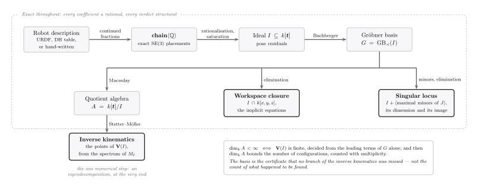
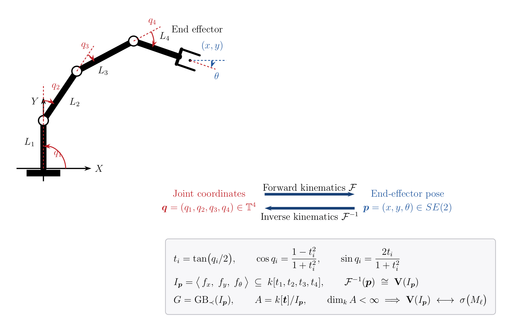
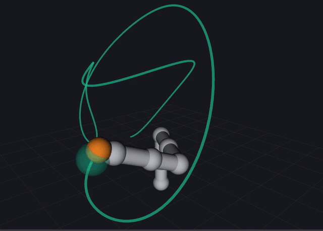
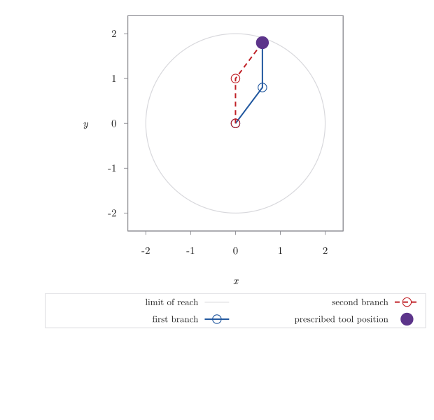
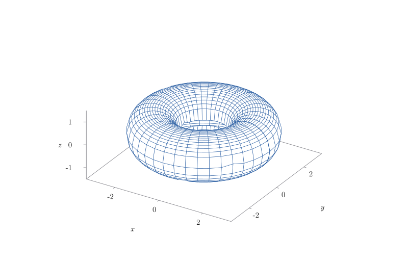
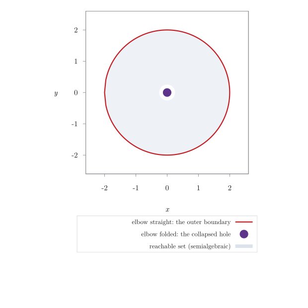
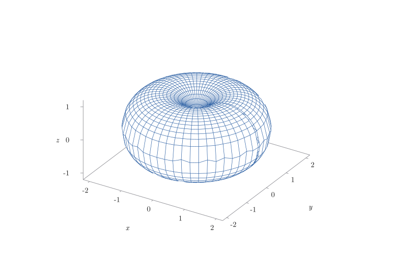

# varietas

**Algebraic kinematics for ROS 2.** Exact inverse kinematics, workspace implicitization, and singularity variety decomposition via Gröbner bases and elimination theory.

varietas treats robot kinematics as what it is — _a system of polynomial equations over a finite-dimensional quotient ring_ — and solves it with the tools of computational algebraic geometry rather than with numerical iteration or structural pattern matching.

Given a URDF, the library recovers the chain exactly over $\mathbb{Q}$, rationalizes the forward kinematics map, and computes a Gröbner basis of the resulting ideal. Solutions are complete: the shape of the ideal certifies that no branch has been missed, and the same ideal yields the implicit equations of the reachable workspace and the singular locus as a variety with a dimension and an image.

Where IKFast pattern-matches known kinematic structures and fails silently outside them, varietas either produces a solution set with a proof of completeness or reports precisely which hypothesis of the Extension Theorem was violated.

  

  <em><strong>Figure 1.</strong> The pipeline. A robot description is recovered exactly over the rationals, rationalised
  into an ideal, and reduced to a Gröbner basis; that one basis then supports all three constructions —
  the configurations, the workspace closure, and the singular locus. Everything up to the last step is
  exact, and the only numerical operation in the library is the eigendecomposition that reads the
  configurations off the action matrix.</em>

---

### Contents

| | |
|---|---|
| **[I. The problem, stated algebraically](#i-the-problem-stated-algebraically)** | the map, the substitution, the ideal |
| **[II. The library](#ii-the-library)** | packages, representation, orders, ideals, solving |
| **[III. Exactness](#iii-exactness)** | rationals, the chain, the URDF front end |
| **[IV. The kinematic constructions](#iv-the-kinematic-constructions)** | saturation, rationalisation, workspace, singularities |
| **[V. Status](#v-status)** | what is done, what is not |

---

## I. The problem, stated algebraically

  

  <em><strong>Figure 2.</strong> Kinematics of a planar serial chain with revolute joints, and its formulation as a
  zero-dimensional polynomial system. Forward kinematics evaluates the map; inverse kinematics
  computes the fibre, which varietas realises as the variety of an ideal in a quotient ring of
  finite dimension.</em>

Let the manipulator have $n$ revolute joints with configuration $\boldsymbol{q}=(q_1,\dots,q_n)\in\mathbb{T}^{n}$ and link parameters $L_1,\dots,L_n$. The forward kinematics is the analytic map

$$\mathcal{F}:\mathbb{T}^{n}\longrightarrow SE(m),\qquad \boldsymbol{q}\longmapsto \boldsymbol{p},$$

with $\boldsymbol{p}=(x,y,\theta)$ for $m=2$ and $\boldsymbol{p}\in SE(3)$ in the spatial case. Inverse kinematics is the determination of the fibre $\mathcal{F}^{-1}(\boldsymbol{p})$ for a prescribed pose $\boldsymbol{p}$, a problem that is transcendental as stated and therefore not directly amenable to exact methods.

#### Rationalisation

Under the tangent half-angle substitution $t_i=\tan(q_i/2)$ one has

$$\cos q_i=\frac{1-t_i^{2}}{1+t_i^{2}},\qquad \sin q_i=\frac{2t_i}{1+t_i^{2}},$$

so that, after clearing the denominators $1+t_i^{2}$, the pose equations become polynomial. Writing $f_x,f_y,f_\theta\in k[t_1,\dots,t_n]$ for the resulting numerators of the pose residuals, the inverse kinematics problem at $\boldsymbol{p}$ is the affine variety of the ideal

$$I_{\boldsymbol{p}}=\big\langle f_x,\;f_y,\;f_\theta\big\rangle\;\subseteq\;k[t_1,\dots,t_n],\qquad \mathcal{F}^{-1}(\boldsymbol{p})\;\cong\;\mathbf{V}\!\left(I_{\boldsymbol{p}}\right),$$

the correspondence being bijective away from the locus $q_i=\pi$, which the substitution sends to infinity and which is removed by saturating with respect to $\prod_i\left(1+t_i^{2}\right)$.

#### Resolution

Let $\prec$ be a monomial order and $G=\mathrm{GB}_{\prec}(I_{\boldsymbol{p}})$ the reduced Gröbner basis, and let $A=k[\boldsymbol{t}]/I_{\boldsymbol{p}}$ be the quotient algebra.

By the Finiteness Theorem, $\dim_k A<\infty$ if and only if $\mathbf{V}(I_{\boldsymbol{p}})$ is finite, a condition decidable from the leading terms of $G$ alone; in that case $\dim_k A$ bounds the number of solutions counted with multiplicity, so the basis itself certifies that no branch of the inverse kinematics has been omitted.

For a generic linear form $\ell\in A$, the points of $\mathbf{V}(I_{\boldsymbol{p}})$ are recovered from the spectrum of the multiplication operator $M_\ell:A\to A$ in the standard monomial basis: by the theorem of Stetter and Möller the left eigenvectors of $M_\ell$ are the evaluation functionals at those points, and each coordinate is obtained by applying the functional to the normal form of $t_i$.

#### Derived objects

The same ideal, treated over the pose coordinates, yields two further constructions.

**The workspace.** Elimination of the joint variables under a block order,

$$I\cap k[x,y,\theta],$$

is the ideal of the Zariski closure of the reachable workspace, by the Closure Theorem; its generators are the implicit equations of that region.

**The singular locus.** It is the variety of the ideal generated by $I$ together with the maximal minors of the manipulator Jacobian, an object the same machinery then measures — its dimension is read off the leading terms, it is separated into branches by saturation, and it is pushed forward into the workspace by a second elimination, where it is the surface the arm cannot cross without losing rank. Singularities are thereby exhibited as a variety with a shape and a location rather than as an undifferentiated set of ill-conditioned configurations.

---

## II. The library

| Package | Role | Depends on |
|---|---|---|
| `varietas_core` | Monomials, polynomials, orders, ideals, quotient algebra, solving | Eigen |
| `varietas_codegen` | Exact rationals over GMP; the offline field | `varietas_core` |
| `varietas_kinematics` | Chains, rationalisation, workspace, singularities | `varietas_core` |
| `varietas_urdf` | URDF → exact chain over $\mathbb{Q}$, with an audit | `varietas_kinematics` |
| `varietas_demo` | RViz demonstration of the recovered chain | ROS 2 |

`varietas_core` is header-only and depends on Eigen alone. It is templated on the coefficient field so that the same code runs over `double` at runtime and over an exact rational type in the offline generator.

#### Representation

Exponent vectors with a cached total degree (`monomial`), and sparse polynomials whose terms are kept sorted and reduced with the monomial order carried in the type (`polynomial`), so that two polynomials written under different orders cannot be combined.

#### Monomial orders

Lexicographic, graded lexicographic, graded reverse lexicographic, block orders `block_order<Split, First, Second>` for elimination, and weighted orders `weight_order<Weights, TieBreak>`.

Each order records an `order_id`, which a generated header stores so that a mismatch between the order used offline and the one assumed at runtime is caught rather than silently producing a wrong solution set.

#### Ideals

The multivariate division algorithm with quotients and remainder; Buchberger's algorithm with the normal selection strategy and both Buchberger criteria, reporting how many critical pairs each criterion discarded; minimalisation and full reduction to the unique reduced Gröbner basis; ideal membership; detection of the unit ideal, that is, of an empty variety.

The `ideal` class caches the basis and exposes `eliminate(split)`, whose output generates the elimination ideal whenever the order is an elimination order for that split, and `dimension()`, which is $\dim\mathbf{V}(I)$ read off the leading terms: a subset of the variables is independent modulo $I$ when no leading monomial is supported inside it, and the dimension is the size of the largest such subset.

The empty variety falls out of the same statement rather than needing a case, since the unit ideal's leading monomial $1$ is supported inside every subset, and it is reported as empty rather than as dimension zero — which is what a point would be. Saturation additionally gives the splitting $\mathbf{V}(I)=\mathbf{V}(I:h^\infty)\cup\mathbf{V}(I+\langle h\rangle)$, exact and exhaustive for any $h$.

#### Quotient algebra

Standard monomials by Macaulay's theorem, together with the finiteness verdict: the quotient is finite dimensional exactly when some leading monomial is a pure power of each variable. Multiplication operators on the quotient are assembled as dense action matrices in that basis.

#### Solving

Zero-dimensional systems are solved by the eigendecomposition of the action matrix of a generic linear form, in the formulation of Stetter and Möller: the left eigenvectors are the evaluation functionals at the points of the variety, and each coordinate is recovered by applying the functional to the normal form of the corresponding variable.

Complex and real points are reported separately, a residual is available to certify any point, and every failure mode is named — empty variety, positive dimension, a defective eigenstructure — rather than returning a quietly truncated solution set.

---

## III. Exactness

#### Exact arithmetic

`varietas_codegen` is the offline half of the library and supplies the field the Gröbner computation actually runs over: `varietas::rational`, arbitrary precision rationals backed by GMP, together with the `coefficient_traits` specialisation that the core algorithms consult.

Nothing in `varietas_core` changes — the ideal, quotient and solving layers were already templated on the coefficient type — so the same Buchberger implementation runs over $\mathbb{Q}$ offline and over `double` at runtime, and the two are exercised by the same test bodies instantiated twice.

The distinction is not fastidiousness. Buchberger's algorithm terminates a critical pair when the S-polynomial reduces to zero, and reduction to zero is a structural test: the term list is empty. Over a floating point field cancellation leaves a residue of the order of the rounding error, the pair is never discarded, the basis accretes spurious elements, and the finiteness verdict read off the leading monomials is then a statement about a different ideal.

`test_exact_groebner` exhibits this on an ideal with non-dyadic coefficients, where an explicit combination $a g_0 + b g_1$ of basis elements is certified as a member over $\mathbb{Q}$ and reported as a non-member over `double`, the obstruction being a single constant term of magnitude $10^{-18}$. Correspondingly, `polynomial::prune`, which discards negligible terms, is now rejected at compile time for an exact coefficient type rather than silently changing the ideal.

The bridge between the two fields is deliberate and narrow: `to_double` and `from_double` are crossed only where the numerics belong, in the assembly of the action matrix and in the eigendecomposition that recovers the points.

#### Robot description

`varietas_kinematics` holds the structure the algebra consumes, and holds nothing else: a `chain<Coeff>` of revolute, prismatic and fixed joints, each carrying its axis and the fixed placement of its frame as an element of SE(3) over the coefficient field, closed by a tool transform.

It knows nothing of URDF, which is the point — the rationalisation, the emitter, the implicitization and the singular locus are written against this structure, so a URDF front end arrives later as a translation into it rather than as a dependency of the pipeline, and hand-written chains and DH tables enter by the same door. The package depends on `varietas_core` alone; the exact field appears only in its tests, where every chain is exercised over $\mathbb{Q}$ and over `double`.

Exactness is enforced where geometry enters rather than assumed. A rotation assembled from roll-pitch-yaw angles has transcendental entries, and rounding them to the nearest rational perturbs the ideal, so that the basis computed downstream is an exact statement about a robot that is not the one on the bench.

The constructors therefore build only rotations that are rational by construction — `rotation_from_quaternion` divides the Euler–Rodrigues matrix by the squared norm, which is exactly orthogonal of determinant one for any nonzero rational quaternion and takes no square root, and `rotation_about_axis` is Rodrigues' formula in a cosine-sine pair rather than an angle — and `chain::validate` then checks orthogonality, properness, unit axes and limits, reporting which joint failed and how instead of a bare verdict.

Over the exact field the only admissible orthogonality defect is zero, and the tolerance argument is not a way round it: a rotation built from the floating point cosine and sine of thirty degrees is accepted over `double` and rejected over $\mathbb{Q}$ on a defect of order $10^{-17}$, the same asymmetry `test_exact_groebner` draws for ideal membership, one layer earlier. The right angles and half turns a URDF is overwhelmingly made of pass exactly, so the strictness costs nothing on real models.

#### The URDF front end

`varietas_urdf` turns a robot description into a chain over $\mathbb{Q}$, or refuses it and names the joint responsible. The difficulty is that a URDF contains no exact geometry: the KUKA iiwa writes $\pi/2$ as `1.57079632679`, and reading that literal as a rational produces an exact answer about a robot whose axes are misaligned by $10^{-12}$ radians — a robot nobody built.

The recovery is a fact about quaternions rather than about angles. A quarter turn has quaternion $(\cos 45^\circ, \sin 45^\circ, 0, 0)$, whose entries are irrational; but a quaternion is homogeneous, and dividing through by any nonzero entry leaves $(1,1,0,0)$, which is integral, and which `rotation_from_quaternion` turns into an exactly orthogonal rational matrix with no normalisation and no square root.

The search is therefore projective: divide by the largest entry, then approximate each of the four by a rational of bounded denominator, by continued fractions. Every multiple of a right angle is recovered exactly this way, and every joint of the iiwa is such a multiple; a genuinely oblique placement is not, and is reported with the deviation it would introduce rather than silently rounded. Lengths are recovered the same way — `0.1575` comes back as $63/400$, the decimal the author wrote rather than the binary approximation the file stores.

  

  <em><strong>Figure 3.</strong> The iiwa posed by <code>robot_state_publisher</code> from the decimals in the URDF; the
  translucent sphere is the tool pose computed by varietas from the exactly recovered chain, and the
  ribbon is the path it has traced. Had the recovery changed the robot, the sphere would drift off the
  tip as the arm moves.</em>

That the two coincide is measured rather than seen. The demonstration looks up the transform `robot_state_publisher` derives from the file and compares it against the pose computed from the exact chain at the same instant, and the agreement is $10^{-12}$ metres, which is the file's truncated $\pi$ propagated through seven joints and a metre of reach. The unit suite makes the same comparison against KDL over two hundred random configurations, off-line and with no timing to confound it.

The lesson of the exercise is one about measurement. The obvious way to report how far a snapped rotation has moved is $\arccos\big((\mathrm{tr}\,R - 1)/2\big)$, and it is useless precisely where it matters: near the identity the trace differs from three by the *square* of the angle, so a deviation of $10^{-12}$ moves the trace by $10^{-24}$, vanishes into rounding, and the recovery is reported as exact when it is not. The chordal form $\|A - B\|_F = 2\sqrt{2}\,\sin(\theta/2)$ has no such cancellation and is accurate all the way down. The same care is needed converting a rational back to a double: GMP's `get_d` truncates towards zero rather than rounding to nearest, which is a whole unit in the last place and always in the same direction.

`urdf_report` prints the audit for any model — which placements were recovered without moving, which were moved onto the exact geometry the decimals approximated, and by how far. For the iiwa:

| | |
|---|---|
| Joints exactly representable | all |
| Worst rotation moved | $4.9\times10^{-12}$ rad |
| Lengths moved | none |
| Recovered origins exactly orthogonal | all — which the file's own were not |

---

## IV. The kinematic constructions

#### Saturation

$I:h^\infty$, computed by Rabinowitsch's trick: adjoin a variable $y$ and the generator $1-yh$, so that in the enlarged ring the variety is the part of $V(I)$ where $h\neq 0$ with $y$ recording $1/h$, then eliminate $y$ and appeal to the Closure Theorem.

The construction is therefore an elimination and uses the block order machinery exactly as it stood — its first real application. Two details earn their keep: the adjoined variable goes first so the block order eliminates it, and the trailing block is ordered by the caller's own order, so what comes back is already a Gröbner basis of the saturation under that order rather than something needing a second Buchberger run. `embed.hpp` supplies the variable shifting, re-sorting terms under the target order rather than copying a term list that was sorted under a different one.

This is what removes the components the half-angle substitution invents. Clearing the denominators $1+t_i^2$ attaches to the variety the loci where they vanish, namely $t_i=\pm i$ — the images of the configurations $q_i=\pi$ that the substitution sent to infinity. Over the reals they are invisible, since $1+t^2$ never vanishes there, and that is precisely why they must be removed symbolically: they are counted regardless, and the count is the completeness certificate.

The tests exhibit both ways it goes wrong. In the mild case the spurious locus is a few extra points and $\dim_k A$ reads 3 where the arm has one configuration. In the severe case — the one that actually arises, where the denominator divides more than one generator — the spurious locus is a whole line, the ideal is not zero-dimensional at all, and the Finiteness Theorem returns no verdict; saturating is what makes the system solvable in the first place, not merely what makes the count right.

#### Rationalisation

`rational_transform` carries a rigid transform whose entries are rational functions of the joint variables. Under the substitution, Rodrigues' formula for a revolute joint about a unit axis reads

$$R=\frac{1}{1+t^{2}}\Big[(1+t^{2})I+2t\,[u]_\times+2t^{2}[u]_\times^{2}\Big],$$

a matrix of quadratics over a single denominator.

The property the representation rests on is that this shape is closed under composition: writing $T=(1/D)[R\mid p]$, the product of two such has rotation $R_aR_b$ and translation $R_ap_b+p_aD_b$ over $D_aD_b$, so the numerators multiply and the denominator exponents add. Nothing else can arise. A transform is therefore a numerator together with the exponent vector $e$ of $\prod_i(1+t_i^2)^{e_i}$, and no common denominator ever has to be computed, no gcd taken.

What it deliberately is not is `matrix3<Coeff>`: that type asks `coefficient_traits` for inverses, and polynomials are not invertible, so the substitution needs its own type — which is the type system saying something true rather than an inconvenience.

Clearing the denominators against a target gives the residuals, and `position_ideal_generators` and `pose_ideal_generators` hand them to saturation. Asking only where the tool is, rather than how it is turned, is the classical problem for an arm with fewer joints than SE(3) has dimensions.

  

  <em><strong>Figure 4.</strong> The two elbow configurations at a single prescribed tool position, both returned by the
  spectral solver. The pose is built by evaluating the rational map at a rational point, so the problem
  never leaves the rationals; the quotient has dimension two over the field, and that number — not
  the count of what was found — is the certificate that no branch is missing.</em>

On the planar two-link arm the pipeline now runs end to end, over $\mathbb{Q}$ throughout. A target built by evaluating the rational map at $t=(1/2,1/3)$ is rational, so nothing leaves the exact field; the saturated ideal is zero-dimensional with $\dim_k A=2$; the configuration the target was built from satisfies every generator exactly, which over the rationals is a structural test and not a residual below a threshold; and the spectral solver returns both elbow branches, each of which puts the tool back on the target. The rational map itself is checked against KDL on the iiwa — seven joints, axes turned by a right angle at every link, which is the composition the closure property has to survive.

Two boundary cases are worth separating, because conflating them is how a solver comes to lie. A point off the plane of the arm is unreachable in the strong sense: the tool has $z=0$ identically, a residual reads $0=1$, the variety is empty over $\bar k$ and the ideal is the whole ring, which is what the weak Nullstellensatz detects. A point in the plane but beyond reach is not that at all — the ideal is not the unit ideal, and $\dim_k A$ still reads 2, because over $\bar k$ the equations solve perfectly well with $\cos q_2=23/2$ and an angle that is not real. Unreachability is a statement about the *real* points of the variety, not about the ideal, and it appears where the solver separates the real solutions from the complex ones and nowhere earlier.

#### Workspace implicitization

Putting the pose coordinates into the ring instead of substituting them turns the residuals into a description of the graph of the forward kinematics map; eliminating the joint variables projects that graph onto the pose coordinates, and by the Closure Theorem the result is the ideal of the Zariski closure of the reachable set. The Rabinowitsch variable and the joint variables are eliminated in a single pass, since computing the saturation in full only to project it afterwards produces an object nobody wants.

The word *closure* carries weight the library should not paper over. The reachable set of an arm is semialgebraic — an annulus, a shell, something with a boundary — and boundaries are cut out by inequalities that no ideal expresses. Where the workspace is full dimensional the closure is everything, and the elimination ideal returns only what held identically.

  

  <em><strong>Figure 5.</strong> The workspace closure of the arm with perpendicular axes: the zero set of the single
  quartic <code>(x²+y²+z²+3)² = 16(x²+y²)</code> that elimination returned. No torus is parameterised
  in drawing this — the surface is traced from the polynomial itself.</em>

The three cases tested make the distinction concrete: a one-joint arm traces the circle $z=0,\ x^2+y^2=1$ and elimination returns it exactly; a planar two-joint arm reaches an annulus and elimination returns $z=0$ and nothing else, so that a point a hundred units away satisfies every equation the closure has; a two-joint arm with perpendicular axes traces a torus, the map is not dominant, and elimination returns the quartic that cuts it out. `workspace_is_dense` reports the middle case rather than leaving an empty result to be misread as a failure.

The exercise also measured something about the formulation. Eliminating for the torus takes seventy seconds. Presenting the *same* arm with two variables per joint and the relation $c^2+s^2=1$ — no denominators, and therefore no saturation at all — eliminates in sixty milliseconds and returns the identical quartic, a factor of a thousand. The half-angle substitution buys one variable per joint rather than two, which is what matters for the zero-dimensional inverse kinematics the library is built around, and pays for it with a denominator, which is what matters here. The two formulations are not competitors so much as tools for different questions, and implicitization has been moved onto the second.

#### The trigonometric formulation

`varietas_kinematics/trigonometric.hpp` is the second rationalisation, carried alongside the first rather than in place of it. Writing $c_i=\cos q_i$ and $s_i=\sin q_i$ as independent variables makes Rodrigues' formula polynomial as it stands,

$$R=I+s\,[u]_\times+(1-c)\,[u]_\times^{2},$$

so a chain composes as an ordinary product of polynomial matrices and `trigonometric_transform` has no denominator field to carry.

The trigonometric identity enters as a generator $c_i^2+s_i^2-1$ on the same footing as the pose residuals — a genuine equation of the problem rather than damage repair. Nothing is cleared, so nothing spurious is attached, so there is nothing to saturate away: the loci $t_i=\pm i$ have no counterpart here, and $\mathbf{V}(c^2+s^2-1)$ is exactly the parameter space of a revolute joint, including the configuration $q=\pi$ that the half-angle map sends to infinity.

| | Half-angle | Trigonometric |
|---|---|---|
| Variables per joint | 1 | 2 |
| Denominators | yes — saturation required | none |
| $q=\pi$ | sent to infinity | ordinary point |
| Used for | inverse kinematics | implicitization, singularities |

Which formulation is better is a question about the shape of the computation rather than about the arm. Inverse kinematics is zero-dimensional and the variable count dominates: $n$ variables against $2n$, with the saturation a single extra elimination paid once, so the half-angle form wins and the solver and the emitter are built on it. Implicitization eliminates the joint variables entirely and the denominators dominate: the Rabinowitsch variable joins the block being eliminated, and the cleared residuals carry the denominator's degree into every S-polynomial. `workspace_relations` therefore runs on the trigonometric ring, and `workspace_relations_half_angle` is kept so that the two can be compared rather than trusted.

That comparison is a test rather than a remark. Both paths are run on the torus arm and their reduced bases are required to be equal, which is what licenses the migration: the elimination ideal does not depend on the parameterisation it was computed through, only the cost does. The same test file checks the two forward kinematics maps against each other exactly — the correspondence $c=(1-t^2)/(1+t^2),\ s=2t/(1+t^2)$ carries a rational $t$ to a rational point of the circle, so a configuration is expressible in both formulations without leaving $\mathbb{Q}$ and the maps must agree identically rather than nearly — and checks that on the circle the composed rotation is exactly orthogonal, the admissible defect over $\mathbb{Q}$ again being zero and not a threshold.

#### The singular locus

A configuration is singular when the differential of the forward kinematics drops rank there, and the arm loses, instantaneously, the ability to move its tool in some direction. The standard treatment evaluates the Jacobian at a configuration and reports its smallest singular value; that is a measurement at a point, and no number of such measurements says what the singular set *is*, how many pieces it has, or where they go in the workspace, because those are questions about a variety.

Algebraically the question is elementary. Rank is not a polynomial condition — it is not even a continuous function of the entries — but rank *deficiency* is: a matrix has rank below $k$ exactly when all its $k\times k$ minors vanish. `minors.hpp` computes those minors over the polynomial ring by Laplace expansion memoised on the set of remaining columns, which is $2^k k$ multiplications rather than $k!$ and, more to the point, is the arrangement that never divides — Gaussian elimination needs to invert a pivot and Bareiss needs exact division, and polynomials offer neither. Adjoined to the circle relations, the maximal minors generate the ideal of the singular locus.

Why the differential is available at all is the trigonometric formulation earning its keep a second time. The differential of a map restricted to a variety is not the Jacobian of the polynomials that cut the variety out; over the half-angle ring one would differentiate the cleared numerators and then correct for the denominators multiplied through, a quotient rule in every entry. Here the correction is unnecessary and the reason is exact: along $c^2+s^2=1$ the tangent at $(c,s)$ is $(-s,c)$, which is precisely $(\mathrm{d}c/\mathrm{d}q,\ \mathrm{d}s/\mathrm{d}q)$, so differentiating the polynomial map along the constraint reproduces $\partial/\partial q$ — and the geometric Jacobian, columns $[\,a_i\times(p-p_i);\,a_i\,]$ straight out of the textbook, is already polynomial in $c$ and $s$. It is checked against central differences of the numerical forward kinematics, which share no code with it.

Which rows of that Jacobian the minors are taken from is the caller's choice, because an arm is singular *for a task* and asking for the wrong one is how a singularity analysis comes to disagree with the robot. A planar three-link arm is singular *everywhere* for the three-dimensional position task, correctly: it can never move its tool out of its plane, so the rank is at most two at every configuration. For the planar pose task it can span, the same arm is singular on the surface $\sin q_2=0$, the elbow alone, the wrist adding no rank. Both are in the tests, adjacent, because the pair is the point.

  

  <em><strong>Figure 6.</strong> The singular image of the planar two-link arm. Elimination returns <code>z</code> together
  with <code>x(x²+y²−4)</code> and <code>y(x²+y²−4)</code>: the circle of radius l₁+l₂ and the point at
  |l₁−l₂|, which is to say the outer boundary of the reachable disc and the hole at its centre. The
  tint is the reachable set, which is semialgebraic and which no ideal cuts out.</em>

The two-link arm shows what the construction is for. Its singular ideal is $\langle c_i^2+s_i^2-1,\ s_2\rangle$ — and the minor itself is $(c_1^2+s_1^2)s_2$, the textbook $l_1l_2\sin q_2$ multiplied by something the determinant has no way of knowing is one, which reduces to $s_2$ modulo the circle relations and not before. The locus is one dimensional, a circle's worth of configurations with the shoulder free and the elbow pinned, and splitting along $c_2-1$ separates the straight elbow from the folded one exactly. Eliminating the joint variables carries it into the workspace as the boundary above: the singular image is the workspace boundary, computed rather than reasoned about.

Two negative results are worth as much as the positive one.

**No real singularity, but not the unit ideal.** The torus arm has no real singularity — its tool is at distance $2+\cos q_2$ from the first axis and that never vanishes — yet its singular ideal is not the unit ideal, because over $\bar k$ the equations solve at $\cos q_2=-2$, $\sin^2q_2=-3$. Eliminated into the workspace this reads $x^2+y^2=0$, $z^2=-3$, which has no real point, and the arm is therefore nowhere singular; but the ideal could not say so, exactly as it could not decide unreachability, and for the same reason: reality is a property of points, not of ideals.

  

  <em><strong>Figure 7.</strong> The same construction on the arm whose offset equals its tool length: the inner circle
  of the torus has closed to a point, and every singular configuration maps to that pinch. The
  elimination returns <code>x</code>, <code>y</code> and <code>z²</code> — not <code>z</code>.</em>

**A non-radical image.** The pinched torus, where the offset equals the tool length, is singular on the circle $c_2=-1$, all of which maps to the origin, and the elimination returns $x$, $y$ and $z^2$ — not $z$. The variety is the single point the Closure Theorem promises, but the ideal is not radical, and the square is not noise: the arm reaches the pinch tangentially in $z$, and the elimination ideal has kept the order of contact that the set alone forgot. Taking a radical would discard it, and varietas cannot take one anyway.

What is deliberately not claimed is a primary decomposition. `split_along` is exact and exhaustive but the caller chooses $h$, and an algorithm that finds its own splittings needs multivariate factorisation over $\mathbb{Q}$, which is a project of its own and not yet begun. What the library offers is the ideal, its dimension, its image in the workspace, and the ability to separate a branch on a divisor the geometry suggests.

---

## V. Status

| Construction | State |
|---|---|
| Monomials, polynomials, orders | complete |
| Division, Buchberger, reduced bases, membership | complete |
| Dimension, saturation, elimination | complete |
| Quotient algebra, action matrices, spectral solving | complete |
| Exact rationals over GMP | complete |
| Chains, validation, exact geometry | complete |
| URDF front end with audit | complete |
| Half-angle and trigonometric rationalisation | complete |
| Workspace implicitization | complete |
| Singular locus, dimension, workspace image | complete |
| Code emission | not begun |
| Factorisation over $\mathbb{Q}$ | not begun |

Code emission is what would turn the offline basis into the header-only runtime solver the design is aimed at; factorisation over $\mathbb{Q}$ is what would turn `split_along` into a decomposition proper.
