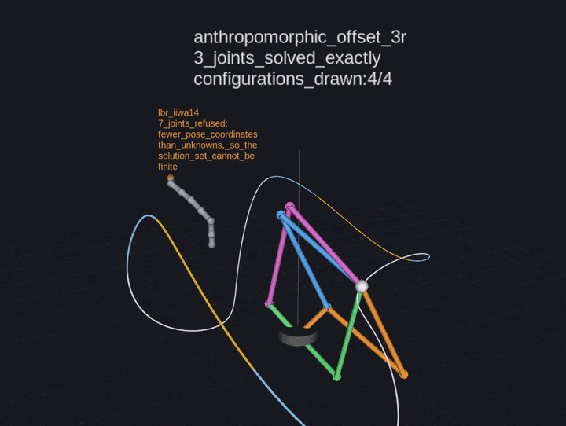

==========
Quickstart
==========

Three things the library does, in the order most people want them.

.. contents::
   :local:
   :depth: 1

Audit a robot description
=========================

Before anything is solved, ask whether the chain can be recovered exactly.

.. code-block:: sh

   ros2 run varietas_urdf urdf_report varietas_urdf/test/data/anthropomorphic_3r.urdf

``urdf_report`` reads the URDF, snaps every joint origin onto a nearby exact
rational pose, and reports the deviation joint by joint. On the KUKA iiwa
shipped in ``varietas_urdf/test/data`` no joint moves by more than
:math:`5\times10^{-12}` radians. A chain that cannot be recovered (a
non-orthonormal rotation, an unsupported joint type, a branch where a serial
chain was expected) is refused here with the reason, rather than silently
approximated.

See :doc:`theory/exactness` for what the snapping does and why it is not a
formality.

Generate a solver from a URDF
=============================

.. code-block:: sh

   ros2 run varietas_urdf urdf_codegen arm.urdf arm_ik.hpp

This poses the inverse kinematics over :math:`\Q(\p)`, with the target adjoined
to the *coefficient field* rather than substituted into the ring so that one
basis answers every pose instead of one basis per pose. It computes the Gröbner
basis once, and writes a self-contained header.

For an arm whose base turns about a fixed axis, sweep that joint out instead of
adjoining it:

.. code-block:: sh

   ros2 run varietas_urdf urdf_codegen arm.urdf arm_ik.hpp --decouple

The generated header is consumed with nothing but a compiler and (for the
``eigen`` runtime) Eigen:

.. code-block:: cpp

   #include <cstdio>
   #include "arm_ik.hpp"

   int main() {
     const double pose[2] = {0.4, 0.1};      // the adjoined parameters, in order
     double out[8 * varietas_generated::urdf_ik::num_unknowns];

     varietas_generated::urdf_ik::status state{};
     const int found = varietas_generated::urdf_ik::solve(pose, out, 8, &state);
     if (found < 0) {
       std::printf("refused: this pose is off the chart\n");
       return 1;
     }
     for (int k = 0; k < found; ++k) {
       const double* q = out + k * varietas_generated::urdf_ik::num_unknowns;
       std::printf("branch %d: %g %g\n", k, q[0], q[1]);
     }
   }

The struct is named ``urdf_ik`` in namespace ``varietas_generated`` unless
``--name`` and ``--namespace`` say otherwise, and ``solve`` returns the number
of real configurations written, or ``-1`` with ``state`` saying why. A
``--decouple`` header additionally defines ``urdf_ik_reduced``, the two-joint
problem the wrapper is built on, whose ``solve`` returns **joint angles in
radians** rather than half-angle variables. See :doc:`guide/generated_headers`.

.. code-block:: sh

   g++ -std=c++17 -O2 consumer.cpp -I. -I/usr/include/eigen3

.. note::

   The parametric path is bounded by the number of parameters adjoined, not by
   the arm. Two parameters, and therefore two joints since the counts force
   :math:`P = N`, is the working limit. Decoupling buys a third.
   See :doc:`guide/decoupling` and :doc:`status`.

Solve one pose exactly
======================

Giving up the parameters buys orientation back. With the target a constant of
:math:`\Q` rather than a parameter of :math:`\Q(\p)`, the twelve equations of a
full pose are no harder for Buchberger than the three of a position.

.. code-block:: sh

   ros2 run varietas_urdf urdf_solve arm.urdf --xyz 0.4 0.1 0.3 --rpy 0 1.57 0
   ros2 run varietas_urdf urdf_solve arm.urdf --xyz 0.4 0.1 0.3 --quat 0 0 0 1
   ros2 run varietas_urdf urdf_solve arm.urdf --xyz 0.4 0.1 0.3 --position-only

This path handles up to five joints in practice; see :doc:`guide/pose_ik` for
the timings and for what happens when an arm has too few joints for the pose
you asked of it.

Watch it move
=============

Two demonstrations, answering the two different questions.

The first is the forward one. ``sweep.launch.py`` drives the joints through a
closed trajectory, lets ``robot_state_publisher`` pose the arm from the
decimals in the file, and puts a marker at the tool pose computed from the
chain varietas recovered exactly. Nothing is solved here; what it shows is that
the marker stays on the arm the file poses, at every configuration.

.. code-block:: sh

   ros2 launch varietas_demo sweep.launch.py urdf:=arm.urdf period:=12.0

.. figure:: figures/urdf_sweep.gif
   :width: 70%
   :alt: A URDF posed from the chain varietas recovered from it, with the tool pose marked

   The arm posed by ``robot_state_publisher`` from the file, the closed curve
   its tool traces over one period, and the marker at the tool pose computed
   from the exactly recovered chain. The agreement is :math:`10^{-12}` metres,
   which no image resolves; the node measures it and prints it to the log.

The second is the question the library exists for. ``branches.launch.py`` moves
a target through the workspace and draws **every** configuration the generated
solver returns for it. The solver is emitted from the URDF during the build, by
the path ``urdf_codegen --decouple`` takes, so the demonstration compiles
against varietas's own output rather than a copy checked in beside it.

.. code-block:: sh

   ros2 launch varietas_demo branches.launch.py

   All four postures at once, and the count on the target's path: it steps
   four, two, zero on the way out, because the shoulder is displaced from the
   base axis and the family facing the target therefore reaches further than
   the family turned away from it. Beside it stands the KUKA LBR iiwa, posed
   but not solved, carrying the sentence
   :cpp:func:`varietas::ik::parametric_position_ik` returns when it is asked
   for a position solver over seven joints.

.. note::

   The arm ``branches.launch.py`` solves is fixed, because the header was
   generated for it at build time; ``urdf:=`` alone will not retarget it. See
   :doc:`guide/decoupling`.
