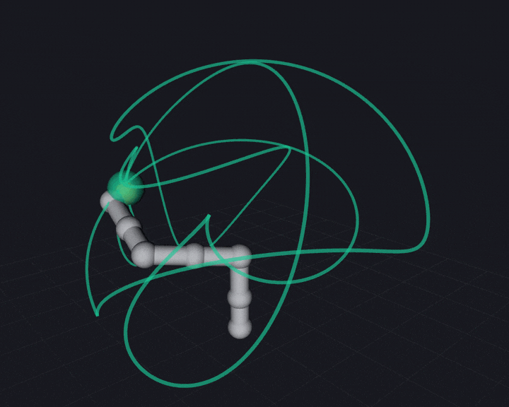

=========
Exactness
=========

Why the field matters
=====================

Buchberger's algorithm terminates a critical pair when the S-polynomial reduces
to zero, and **reduction to zero is a structural test**: the term list is empty.
Over a floating point field cancellation leaves a residue of the order of the
rounding error, the pair is never discarded, the basis accretes spurious
elements, and the finiteness verdict read off the leading monomials is then a
statement about a different ideal.

``test_exact_groebner`` exhibits this on an ideal with non-dyadic coefficients,
where an explicit combination :math:`a g_0 + b g_1` of basis elements is
certified as a member over :math:`\Q` and reported as a non-member over
``double`` — the obstruction being a single constant term of magnitude
:math:`10^{-18}`.

Correspondingly, ``polynomial::prune``, which discards negligible terms, is
**rejected at compile time** for an exact coefficient type rather than silently
changing the ideal.

One implementation, three fields
================================

``varietas_core`` is templated on the coefficient type, so the same Buchberger
implementation runs over

* ``double``, at runtime,
* :cpp:type:`varietas::rational`, arbitrary-precision rationals backed by GMP,
* :cpp:class:`varietas::codegen::rational_function` — the pose adjoined to the
  coefficient field, so that one basis answers every pose,

without modification, and the two former are exercised by the same test bodies
instantiated twice.

The bridge between the fields is deliberate and narrow: ``to_double`` and
``from_double`` are crossed only where the numerics belong — in the assembly of
the action matrix and in the eigendecomposition that recovers the points.

Exact geometry
==============

Exactness is enforced where geometry enters rather than assumed. A rotation
assembled from roll-pitch-yaw angles has transcendental entries, and rounding
them to the nearest rational perturbs the ideal, so that the basis computed
downstream is an exact statement about a robot that is not the one on the bench.

The constructors therefore build only rotations that are rational **by
construction**:

* :cpp:func:`varietas::rotation_from_quaternion` divides the Euler–Rodrigues
  matrix by the squared norm, which is exactly orthogonal of determinant one for
  any nonzero rational quaternion, and takes no square root;
* :cpp:func:`varietas::rotation_about_axis` is Rodrigues' formula in a
  cosine–sine pair rather than an angle.

``chain::validate`` then checks orthogonality, properness, unit axes and limits,
reporting *which joint failed and how* rather than a bare verdict.

Over the exact field the only admissible orthogonality defect is zero, and the
tolerance argument is not a way round it: a rotation built from the floating
point cosine and sine of thirty degrees is accepted over ``double`` and rejected
over :math:`\Q` on a defect of order :math:`10^{-17}`. The right angles and
half turns a URDF is overwhelmingly made of pass exactly, so the strictness
costs nothing on real models.

Recovering a URDF exactly
=========================

A URDF contains no exact geometry. The KUKA iiwa writes :math:`\pi/2` as
``1.57079632679``, and reading that literal as a rational produces an exact
answer about a robot whose axes are misaligned by :math:`10^{-12}` radians — a
robot nobody built.

The recovery is a fact about quaternions rather than about angles. A quarter
turn has quaternion :math:`(\cos 45^\circ, \sin 45^\circ, 0, 0)`, whose entries
are irrational; but a quaternion is homogeneous, and dividing through by any
nonzero entry leaves :math:`(1,1,0,0)`, which is integral, and which
:cpp:func:`varietas::rotation_from_quaternion` turns into an exactly orthogonal
rational matrix with no normalisation and no square root.

The search is therefore projective: divide by the largest entry, then
approximate each of the four by a rational of bounded denominator, by continued
fractions (:cpp:func:`varietas::urdf_import::snap_rotation`). Every multiple of
a right angle is recovered exactly this way, and every joint of the iiwa is
such a multiple; a genuinely oblique placement is not, and is **reported with
the deviation it would introduce** rather than silently rounded.

Lengths are recovered the same way — ``0.1575`` comes back as :math:`63/400`,
the decimal the author wrote rather than the binary approximation the file
stores.

   The iiwa posed by ``robot_state_publisher`` from the decimals in the URDF,
   and the closed curve its tool traces over one full period of the sweep, held
   whole rather than trailing behind the tool, so that the arm is seen moving
   through a fixed object. The green marker is the tool pose computed by
   varietas from the exactly recovered chain, and what the recording shows is
   that it stays on the arm the file poses and on the curve it drew, at every
   configuration of the sweep. How closely the two agree it does not show, and
   no image could: the figure is drawn at about four millimetres to the pixel
   and the disagreement is :math:`10^{-12}` metres. The orange spheres are the
   URDF's own — it draws one at every joint origin — so the one beside the
   marker is the wrist, not a second estimate of the tool pose.

That the two coincide is measured rather than seen. The demonstration looks up
the transform ``robot_state_publisher`` derives from the file and compares it
against the pose computed from the exact chain at the same instant; the
agreement is :math:`10^{-12}` metres, which is the file's truncated :math:`\pi`
propagated through seven joints and a metre of reach. The unit suite makes the
same comparison against KDL over two hundred random configurations, off-line and
with no timing to confound it.

.. list-table:: ``urdf_report`` on the KUKA LBR iiwa 14
   :header-rows: 0
   :widths: 55 45

   * - Joints exactly representable
     - all
   * - Worst rotation moved
     - :math:`4.9\times10^{-12}` rad
   * - Lengths moved
     - none
   * - Recovered origins exactly orthogonal
     - all — which the file's own were not

A note on measuring the deviation
=================================

The obvious way to report how far a snapped rotation has moved is
:math:`\arccos\big((\operatorname{tr} R - 1)/2\big)`, and it is useless
precisely where it matters: near the identity the trace differs from three by
the *square* of the angle, so a deviation of :math:`10^{-12}` moves the trace by
:math:`10^{-24}`, vanishes into rounding, and the recovery is reported as exact
when it is not.

The chordal form :math:`\|A - B\|_F = 2\sqrt{2}\,\sin(\theta/2)` has no such
cancellation and is accurate all the way down; it is what
:cpp:func:`varietas::urdf_import::rotation_distance` computes.

The same care is needed converting a rational back to a double: GMP's ``get_d``
truncates towards zero rather than rounding to nearest, which is a whole unit in
the last place and always in the same direction, so
:cpp:func:`varietas::urdf_import::nearest_double` does the rounding itself.
